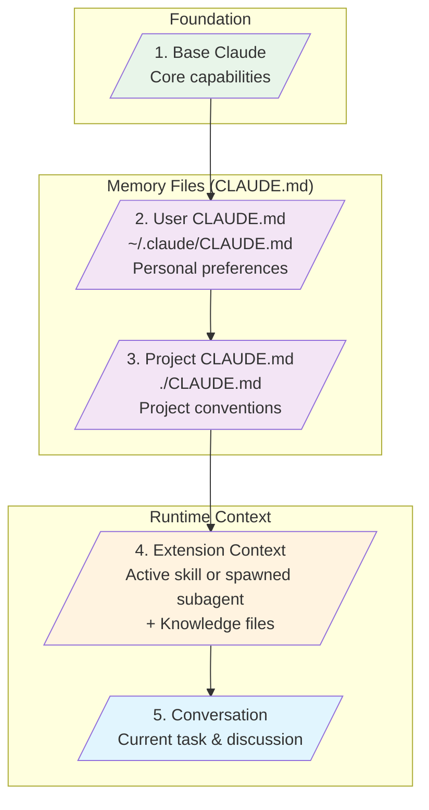

# Claude Code Extension Design Principles

<!--
  NOTE: This is the authoritative source for this document.
  A copy exists at docs/EXTENSION_FRAMEWORK.md for broader visibility.
  If updating this file, please also update the copy in docs/.
-->

This document defines the architecture and quality standards for Claude Code extensions.
It serves as the authoritative reference for the claude-code-expert agent's expertise.

## Extension Types

### Subagent (WHO)

**Note:** Claude Code (the orchestrator) is the primary agent. The definitions in
`/agents` folders are **subagents** - specialists that get spawned for specific
expertise.

Subagents represent **expertise and judgment**. They are domain experts spawned
to apply knowledge to problems.

**Contains:**

- Identity and persona
- Expertise areas and domains
- Judgment frameworks (how they think about trade-offs)
- Quality standards (good enough vs excellent)
- Capabilities (what they can do)

**Does NOT contain:**

- Step-by-step procedures
- Script invocations
- Output format specifications (caller provides these)

**Analogy:** Hiring a specialist consultant. You (the orchestrator) describe the
problem; they apply their domain expertise. When done, control returns to you.

### Skill (HOW)

Skills provide **process definitions and execution capabilities**. They are the
operational playbook that covers both what should happen and how to make it happen.

Skills range from simple user-invocable entry points to complex automation
workflows with Python scripts, Jinja2 templates, and reference documentation.

**Contains:**

- Process steps (thinking, deciding, doing)
- Activation triggers
- Workflow phases (get-questions, execute)
- Script invocations and parameters
- Output contracts for agent spawning
- Templates and path resolution
- Agent spawns (when specialized expertise is needed)
- Decision points and judgment criteria
- Argument hints and user-facing help

**Does NOT contain:**

- Domain expertise ("why X is better than Y")
- Quality judgments (that belongs in Agents)

**Analogy:** A recipe combined with kitchen tools. The skill defines the process
("mix ingredients, bake at 350") and provides the automation to execute it.

**Key insight:** Skills are inert text. They define a process that includes
cognitive steps ("analyze this", "decide which approach") and execution steps
("run this script"). The orchestrator reads the skill and actually performs
those steps.

### Knowledge (CONTEXT)

Knowledge is **reference material**. Facts, patterns, and examples that inform decisions.

**Contains:**

- Schemas and specifications
- Design patterns and anti-patterns
- Best practices (as principles, not procedures)
- Examples of good vs bad implementations
- Decision criteria

**Does NOT contain:**

- Step-by-step procedures
- Orchestration logic
- User-facing commands

**Analogy:** Reference books on a consultant's shelf.

### CLAUDE.md (MEMORY FILES)

CLAUDE.md files are **memory files** - persistent context that's always loaded.
They appear in `/context` output as "Memory files" and provide project and
user-level context for every request.

**Contains:**

- Project structure and conventions
- Coding standards and preferences
- Tool and workflow guidance
- Team practices

**Does NOT contain:**

- Secrets or credentials
- User-specific absolute paths
- Temporary notes

**Analogy:** Onboarding documentation for a new team member - everything they need
to know about how this project/team works. Always in their mind, not looked up.

**Scope levels (both always loaded):**

- `~/.claude/CLAUDE.md` - User preferences (global memory)
- `./CLAUDE.md` - Project conventions (project memory)

**Key distinction from Knowledge:**

- **Knowledge** = Extension-bundled, loaded when agent/skill is active
- **CLAUDE.md** = Environment memory, always loaded for every request

### Plugin (DISTRIBUTION)

Plugins are **distribution containers**. They package agents, skills,
and knowledge for installation and sharing.

**Contains:**

- Bundled agents and skills
- Plugin metadata (plugin.json)
- Documentation (README)

**Does NOT contain:**

- Behavior definitions (that's what the bundled components do)
- User configuration

**Analogy:** A cookbook that contains recipes and techniques (skills)
and chef expertise (agents) - packaged for distribution.

### Hooks (AUTOMATION)

Hooks are **deterministic shell commands** that execute at specific lifecycle
events. Unlike other extensions that rely on LLM judgment, hooks provide
guaranteed execution - things that MUST happen.

**Contains:**

- Shell commands to execute
- Matcher patterns (which tools trigger the hook)
- Lifecycle event bindings (PreToolUse, PostToolUse, etc.)

**Does NOT contain:**

- LLM-guided logic (hooks are deterministic)
- Complex workflows (use Skills)
- Domain expertise (use Agents)

**Analogy:** Factory automation - quality checks that run on every widget,
regardless of who's operating the machine. The conveyor belt triggers the
scanner; no human judgment required.

**Key distinction from other types:**

- **Skills** = LLM decides when/how to use them
- **Hooks** = Automatically triggered, always execute

**Lifecycle events:**

- `PreToolUse` / `PostToolUse` - Before/after tool execution
- `SessionStart` / `SessionEnd` - Session lifecycle
- `UserPromptSubmit` - When user submits prompt
- `Notification` / `Stop` - Response lifecycle
- `SubagentStop` / `PreCompact` - Agent lifecycle

---

## Context Layering

When Claude processes a request, context is layered from multiple sources.

The `/context` command shows this as **Memory files** - persistent context that's
always loaded for every request:

```text
Memory files - /memory
+- User (~/.claude/CLAUDE.md): 43 tokens
+- Project (./CLAUDE.md): 282 tokens
```

### Visual Model



### Layer Stack

```text
+-----------------------------------------------------+
|  5. Conversation Context                            |
|     What's been discussed, current task             |
+-----------------------------------------------------+
|  4. Extension Context                               |
|     Active skill or spawned subagent                |
|     + Subagent's knowledge files                    |
+-----------------------------------------------------+
|  3. Project CLAUDE.md  --+                          |
|     ./CLAUDE.md          | "Memory files"           |
+--------------------------+ Always loaded             |
|  2. User CLAUDE.md     --+                          |
|     ~/.claude/CLAUDE.md                             |
+-----------------------------------------------------+
|  1. Base Claude                                     |
|     Core capabilities and knowledge                 |
+-----------------------------------------------------+
```

**How layers combine:**

- Lower layers provide defaults
- Higher layers can override or extend
- Project settings override user settings for project-specific concerns
- Extension context (skill/subagent) adds task-specific guidance
- Conversation context is the immediate task at hand

**Example flow:**

1. User has `~/.claude/CLAUDE.md` with preference: "Use pnpm"
2. Project has `./CLAUDE.md` with: "Use npm for this legacy project"
3. User invokes `/test` skill
4. Orchestrator reads the skill (testing process definition)
5. Orchestrator spawns `test-expert` subagent with testing knowledge
6. Subagent applies expertise within project context (uses npm, not pnpm)

**Key insight:** Context flows down but specificity wins. Project overrides user.
Extension context adds to (doesn't replace) environment context.

---

## The Consultant Rule

When you hire an expert, you don't give them a procedure manual.

**You give them:**

- Project context (the system, constraints)
- The specific problem ("We need X")
- Output format expectations ("Provide a design document")

**They bring:**

- Judgment (when to break rules, what trade-offs to make)
- Pattern recognition ("This looks like problem type X")
- Quality standards (what "good" looks like to them)

This is how agents should work. The orchestrator (skill) provides context and format;
the agent applies expertise.

---

## Extensions Are Definitions

All extension types are **inert text** - they define behavior but don't execute it.

| Type | Role | Defines | Loaded |
| ---- | ---- | ------- | ------ |
| **Subagent** | WHO | Expertise to embody | When spawned |
| **Skill** | HOW | Process + execution capabilities | When activated |
| **Knowledge** | CONTEXT | Facts to reference | With extension |
| **CLAUDE.md** | MEMORY | Environment context | Always |
| **Plugin** | DISTRIBUTION | Container | When installed |
| **Hooks** | AUTOMATION | Deterministic actions | On lifecycle events |

**Note:** The orchestrator (Claude Code) is the primary agent. Subagents are
specialists spawned for specific expertise - they live in `/agents` folders.

**Nothing happens until the orchestrator reads these definitions and acts.**

A Skill says "analyze X, decide Y, run this script" - but doesn't analyze, decide,
or run. The orchestrator does.

A Subagent definition says "you are an expert in X with these standards" - but
doesn't think. Claude embodies that expertise when spawned via the Task tool.

Knowledge just sits there until someone reads it.

**This matters because:**

- Don't confuse the definition with the execution
- Skills can define complex processes (they're just instructions + automation)
- The orchestrator is always the one doing the work

---

## Quality Standards: Subagents

### What Belongs

```markdown
## Your Expertise
You understand X deeply. You know:
- The principles behind Y
- The trade-offs between A and B
- When rules should be broken

## Your Judgment
When evaluating X, you consider:
- [Quality dimension]: [what good looks like]

## Your Standards
- [Standard]: [rationale]
```

### What Does NOT Belong

```markdown
## BAD: Procedural Steps
1. Run `python script.py --get-questions`
2. Parse the JSON output
3. Use AskUserQuestion if needed

## BAD: Output Contracts
Return JSON: { "files": [...], "validation": {...} }
```

### Good Enough

- Clear identity statement
- Expertise areas defined
- References knowledge files
- Accepts output format from caller

### Excellent

- Rich judgment framework
- Explicit quality standards
- "Good enough" vs "excellent" criteria defined
- Expertise informs decisions without dictating steps

---

## Quality Standards: Skills

### What Belongs

- Clear process definition (the recipe + the tools)
- Activation triggers (when this skill is relevant)
- Thinking steps (analyze, evaluate, decide)
- Workflow phases (get-questions, execute)
- Script invocations and parameters
- Output contracts for agent spawning
- Path resolution for resources
- Agent spawns for expertise needs
- Argument hints and user-facing help

### What Does NOT Belong

- Domain expertise ("why X is better than Y")
- Best practices (unless operational)
- Quality judgments (use Agents for this)

### Good Enough

- Clear activation criteria
- Working script invocations
- Proper frontmatter with argument hints (if user-invocable)
- Basic workflow documented

### Excellent

- Well-structured process with clear phases
- Two-phase API pattern (get-questions -> execute)
- Complete output contracts for agent spawning
- Appropriate separation (thinking in skill, execution in scripts)
- Error handling documented
- Resources clearly organized (scripts/, templates/, references/)
- Handles edge cases gracefully

---

## Quality Standards: Knowledge

### What Belongs

- Schemas and specifications
- Design patterns with rationale
- Anti-patterns with explanations
- Decision criteria ("when to use X vs Y")
- Examples of good vs poor implementations

### What Does NOT Belong

- Step-by-step procedures
- Script invocations
- User-facing commands

### Good Enough

- Accurate information
- Clear organization
- Referenced by agent

### Excellent

- Decision trees for choosing options
- Before/after examples
- Common mistakes explained
- Cross-references to related knowledge

---

## Quality Standards: Plugins

### What Belongs

- Plugin manifest (plugin.json)
- Bundled agents and skills
- README documentation
- Proper directory structure

### What Does NOT Belong

- User-specific configuration
- Secrets or credentials

### Good Enough

- Valid plugin.json with required fields
- At least one agent or skill
- Basic README

### Excellent

- Comprehensive README with examples
- Well-organized component structure
- Version documented
- Marketplace metadata complete

---

## Quality Standards: CLAUDE.md

### What Belongs

- Project-specific instructions
- Coding conventions
- Tool preferences
- Workflow guidance

### What Does NOT Belong

- Secrets or credentials
- User-specific paths (use ~ expansion)
- Temporary notes

### Good Enough

- Accurate project description
- Key conventions documented

### Excellent

- Comprehensive but concise
- Organized by topic
- Updated with project evolution
- Includes examples of preferred patterns

---

## Quality Standards: Hooks

### What Belongs

- Shell commands that execute reliably
- Specific matcher patterns
- Clear lifecycle event binding
- Deterministic behavior (same input = same output)

### What Does NOT Belong

- Complex conditional logic (use Skills)
- LLM-dependent decisions
- Interactive prompts (hooks are non-interactive)
- Long-running processes without timeout handling

### Good Enough

- Working shell command
- Appropriate event binding
- Handles errors gracefully (non-zero exit when needed)

### Excellent

- Focused, single-purpose hooks
- Proper use of jq for JSON input parsing
- Security-conscious (no credential exposure)
- Well-documented purpose and behavior
- Tested in isolation before deployment
