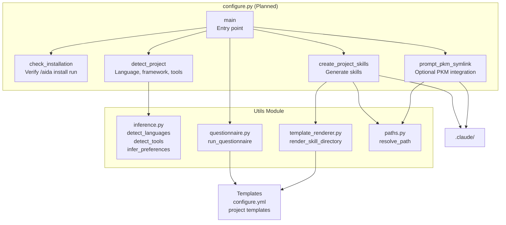
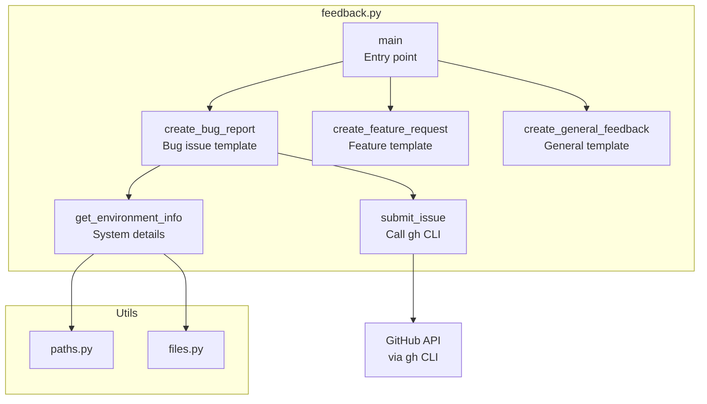

# C4 Component Diagram - AIDA Core Plugin

**Component Level**: Detailed view of Python scripts and utilities module

## Overview

This diagram shows the internal components of AIDA's Python scripts and how they interact with the
utilities module and external systems.

## Install Script Components

```mermaid
graph TB
    subgraph "install.py"
        MainInstall[main<br/>Entry point & orchestration]
        WelcomePrint[print_welcome<br/>Display welcome message]
        AlreadyInstalled[is_already_installed<br/>Check existing installation]
        CreateDirs[create_directory_structure<br/>Create skill directories]
        RenderPrefs[render_personal_preferences<br/>Generate preferences skill]
        RenderPatterns[render_work_patterns<br/>Generate patterns skill]
        UpdateSettings[update_settings_json<br/>Update Claude settings]
        PrintSuccess[print_success<br/>Display success message]
        ErrorHandler[exception handler<br/>Handle errors & cleanup]
    end

    subgraph "Utils Module"
        VersionCheck[version.py<br/>check_python_version]
        PathsGet[paths.py<br/>get_claude_dir<br/>ensure_directory]
        FilesIO[files.py<br/>read_json<br/>write_json<br/>update_json]
        Questionnaire[questionnaire.py<br/>run_questionnaire<br/>load_questionnaire]
        TemplateRender[template_renderer.py<br/>render_skill_directory<br/>render_template]
        ErrorClasses[errors.py<br/>VersionError<br/>InstallationError]
    end

    Templates[Templates<br/>install.yml<br/>SKILL.md.jinja2]
    GlobalFS[~/.claude/]

    MainInstall --> WelcomePrint
    MainInstall --> VersionCheck
    MainInstall --> AlreadyInstalled
    MainInstall --> Questionnaire
    MainInstall --> CreateDirs
    MainInstall --> RenderPrefs
    MainInstall --> RenderPatterns
    MainInstall --> UpdateSettings
    MainInstall --> PrintSuccess
    MainInstall --> ErrorHandler

    AlreadyInstalled --> PathsGet
    AlreadyInstalled --> FilesIO

    CreateDirs --> PathsGet

    RenderPrefs --> TemplateRender
    RenderPrefs --> PathsGet
    RenderPatterns --> TemplateRender
    RenderPatterns --> PathsGet

    UpdateSettings --> FilesIO
    UpdateSettings --> PathsGet

    Questionnaire --> Templates
    TemplateRender --> Templates

    VersionCheck -.->|Throws| ErrorClasses
    FilesIO -.->|Throws| ErrorClasses
    TemplateRender -.->|Throws| ErrorClasses

    CreateDirs --> GlobalFS
    RenderPrefs --> GlobalFS
    RenderPatterns --> GlobalFS
    UpdateSettings --> GlobalFS

    style MainInstall fill:#438dd5
    style WelcomePrint fill:#85bbf0
    style AlreadyInstalled fill:#85bbf0
    style CreateDirs fill:#85bbf0
    style RenderPrefs fill:#85bbf0
    style RenderPatterns fill:#85bbf0
    style UpdateSettings fill:#85bbf0
    style PrintSuccess fill:#85bbf0
    style ErrorHandler fill:#85bbf0
    style VersionCheck fill:#c0d9eb
    style PathsGet fill:#c0d9eb
    style FilesIO fill:#c0d9eb
    style Questionnaire fill:#c0d9eb
    style TemplateRender fill:#c0d9eb
    style ErrorClasses fill:#c0d9eb
```



## Component Details

### Install Script Components

#### main()

##### Responsibility

Orchestrate installation process

##### Pseudocode

```python
def main() -> int:
    try:
        check_python_version()

        if is_already_installed():
            if not confirm_reinstall():
                return 0
            backup_existing_installation()

        print_welcome()

        responses = run_questionnaire("install.yml")

        create_directory_structure()

        render_personal_preferences(responses)
        render_work_patterns(responses)

        update_settings_json()

        print_success()

        return 0

    except KeyboardInterrupt:
        print("\nInstallation cancelled")
        return 130

    except Exception as e:
        handle_error(e)
        return 1
```

##### Dependencies

- All utils modules
- All other install.py functions

##### Error Handling

- Catches KeyboardInterrupt → Exit 130
- Catches all exceptions → Error message + Exit 1

#### is_already_installed()

##### Responsibility

Check if personal skills already exist

##### Algorithm

```python
def is_already_installed() -> bool:
    claude_dir = get_claude_dir()
    personal_prefs = claude_dir / "skills/personal-preferences"
    work_patterns = claude_dir / "skills/work-patterns"

    return personal_prefs.exists() and work_patterns.exists()
```

##### Returns

True if both personal skills exist

#### create_directory_structure()

##### Responsibility

Create necessary directories

##### Algorithm

```python
def create_directory_structure() -> None:
    claude_dir = get_claude_dir()

    ensure_directory(claude_dir / "skills")
    ensure_directory(claude_dir / "skills/personal-preferences")
    ensure_directory(claude_dir / "skills/work-patterns")
    ensure_directory(claude_dir / "skills/aida-core")
```

##### Error Handling

Raises FileOperationError if cannot create

#### render_personal_preferences()

##### Responsibility

Generate personal preferences skill from template

##### Algorithm

```python
def render_personal_preferences(responses: dict) -> None:
    template_dir = Path(__file__).parent.parent / "templates/blueprints/personal-preferences"
    output_dir = get_claude_dir() / "skills/personal-preferences"

    variables = {
        "coding_standards": responses["coding_standards"],
        "communication_style": responses["communication_style"],
        "primary_tools": responses["primary_tools"],
        "decision_tracking": responses["decision_tracking"]
    }

    render_skill_directory(template_dir, output_dir, variables)
```

##### Dependencies

- template_renderer.py
- paths.py

#### update_settings_json()

##### Responsibility

Enable aida-core-plugin in settings.json

##### Algorithm

```python
def update_settings_json() -> None:
    claude_dir = get_claude_dir()
    settings_path = claude_dir / "settings.json"

    updates = {
        "enabledPlugins": {
            "aida-core@aida": True
        }
    }

    update_json(settings_path, updates)
```

##### Behavior

- Creates settings.json if doesn't exist
- Merges updates (doesn't overwrite existing)
- Preserves other settings

### Configure Script Components (Planned)



### Feedback Script Components



## Utils Module Components

### version.py

#### Purpose

Python version validation

#### Components

```python
MIN_PYTHON_VERSION = (3, 8)

def check_python_version() -> None:
    """Raises VersionError if Python < 3.8"""

def get_python_version() -> tuple:
    """Returns (major, minor, patch)"""

def is_compatible_version(version: tuple) -> bool:
    """Check if version >= MIN_PYTHON_VERSION"""

def format_version(version: tuple) -> str:
    """Format as 'X.Y.Z'"""
```

#### Dependencies

None (uses sys.version_info)

### paths.py

#### Purpose

Path resolution and directory management

#### Components

```python
def get_home_dir() -> Path:
    """Returns user's home directory"""

def get_claude_dir() -> Path:
    """Returns ~/.claude/"""

def get_aida_skills_dir() -> Path:
    """Returns ~/.claude/skills/"""

def ensure_directory(path: Path) -> Path:
    """Create directory if doesn't exist, returns path"""

def resolve_path(path: str) -> Path:
    """Expand ~, resolve relative paths"""

def is_subdirectory(child: Path, parent: Path) -> bool:
    """Check if child is under parent"""

def get_relative_path(path: Path, base: Path) -> Path:
    """Get path relative to base"""
```

#### Dependencies

pathlib, os

### files.py

#### Purpose

File I/O operations

#### Components

```python
def read_file(path: Path) -> str:
    """Read text file, raises FileOperationError"""

def write_file(path: Path, content: str) -> None:
    """Write text file, creates parent dirs"""

def read_json(path: Path) -> dict:
    """Read and parse JSON file"""

def write_json(path: Path, data: dict) -> None:
    """Write dict as JSON with formatting"""

def update_json(path: Path, updates: dict) -> None:
    """Merge updates into existing JSON"""

def copy_template(src: Path, dst: Path) -> None:
    """Copy file, create parent dirs"""

def file_exists(path: Path) -> bool:
    """Check if file exists"""

def directory_exists(path: Path) -> bool:
    """Check if directory exists"""
```

#### Dependencies

json, pathlib, errors.py

### questionnaire.py

#### Purpose

Interactive user prompts

#### Components

```python
def load_questionnaire(path: Path) -> dict:
    """Load YAML questionnaire definition"""

def run_questionnaire(template_path: Path) -> dict:
    """Run interactive questionnaire, return responses"""

def filter_questions(questions: list, condition) -> list:
    """Filter questions based on condition"""

def questions_to_dict(responses: list) -> dict:
    """Convert response list to dict"""

# Internal helpers
def _ask_text_question(q: dict) -> str
def _ask_choice_question(q: dict) -> str
def _ask_multiline_question(q: dict) -> str
def _ask_confirm_question(q: dict) -> bool
def _display_help(help_text: str) -> None
```

#### Dependencies

yaml, files.py

#### Question Types

- `text`: Single-line input
- `multiline`: Multi-line (Ctrl+D)
- `choice`: Select from options
- `confirm`: Yes/no

### inference.py

#### Purpose

Smart project detection

#### Components

```python
def infer_preferences(project_path: Path) -> dict:
    """Detect all project characteristics"""

def detect_languages(path: Path) -> list:
    """Detect programming languages"""

def detect_tools(path: Path) -> list:
    """Detect build tools, package managers"""

def detect_coding_standards(path: Path) -> list:
    """Detect linters, formatters"""

def detect_testing_approach(path: Path) -> str:
    """Detect testing frameworks"""

def detect_project_type(path: Path) -> str:
    """Infer project category"""
```

#### Detection Methods

- File extension analysis (`.py`, `.js`, etc.)
- Config file detection (`package.json`, `pyproject.toml`)
- Directory structure patterns (`src/`, `tests/`)
- Dependency analysis (from package files)

#### Dependencies

files.py, paths.py

### template_renderer.py

#### Purpose

Jinja2 template rendering

#### Components

```python
def render_template(template_path: Path, variables: dict) -> str:
    """Render single template file"""

def render_filename(filename: str, variables: dict) -> str:
    """Render filename template"""

def render_skill_directory(
    template_dir: Path,
    output_dir: Path,
    variables: dict
) -> None:
    """Recursively render directory"""

def is_binary_file(path: Path) -> bool:
    """Check if file is binary"""

def is_template_file(path: Path) -> bool:
    """Check if file has .jinja2 extension"""

def get_output_filename(template_name: str) -> str:
    """Remove .jinja2 extension"""
```

#### Dependencies

jinja2, files.py

#### Template Features

- Variable substitution: `{{ variable }}`
- Conditionals: ``
- Loops: ``
- Filters: `{{ name | title }}`

### errors.py

#### Purpose

Custom exception hierarchy

#### Components

```python
class AidaError(Exception):
    """Base exception for all AIDA errors"""

class VersionError(AidaError):
    """Python version incompatible"""

class PathError(AidaError):
    """Invalid or inaccessible path"""

class FileOperationError(AidaError):
    """File I/O operation failed"""

class ConfigurationError(AidaError):
    """Configuration invalid or missing"""

class InstallationError(AidaError):
    """Installation failed"""
```

#### Usage

```python
if sys.version_info < (3, 8):
    raise VersionError("Python 3.8+ required")
```

## Inter-Component Communication

### Call Patterns

#### Synchronous Calls

All communication is synchronous function calls.

```python
# install.py calls utils
responses = run_questionnaire(template_path)
render_skill_directory(template_dir, output_dir, responses)
update_json(settings_path, updates)
```

#### No Asynchronous Operations

Simplicity over performance for M1.

### Data Flow

#### Installation Data Flow

```text
install.yml (YAML)
    ↓ load_questionnaire()
Question Definitions (dict)
    ↓ run_questionnaire()
User Responses (dict)
    ↓ render_personal_preferences()
Template Variables (dict)
    ↓ render_template()
Rendered SKILL.md (str)
    ↓ write_file()
~/.claude/skills/personal-preferences/SKILL.md
```

#### Configuration Data Flow (Planned)

```text
Project Directory
    ↓ infer_preferences()
Detected Info (dict)
    ↓ (merged with)
configure.yml
    ↓ run_questionnaire()
User Responses (dict)
    ↓ render_skill_directory()
Project Skills
    ↓ write files
.claude/skills/project-context/SKILL.md
```

## Error Flow

```text
Low-Level Error (OSError, JSONDecodeError, etc.)
    ↓ caught by utils
Custom AIDA Exception (FileOperationError, etc.)
    ↓ propagated to
Script (install.py, configure.py)
    ↓ caught in main()
User-Friendly Error Message
    ↓
Exit with code 1
```

## Component Dependencies

### Dependency Graph

```text
install.py
    ├─→ version.py (no dependencies)
    ├─→ paths.py (depends on: errors.py)
    ├─→ files.py (depends on: errors.py, paths.py)
    ├─→ questionnaire.py (depends on: files.py)
    ├─→ template_renderer.py (depends on: files.py, errors.py)
    └─→ errors.py (no dependencies)

configure.py (planned)
    ├─→ paths.py
    ├─→ files.py
    ├─→ questionnaire.py
    ├─→ inference.py (depends on: files.py, paths.py)
    ├─→ template_renderer.py
    └─→ errors.py

feedback.py
    ├─→ paths.py
    ├─→ files.py
    └─→ errors.py
```

### No Circular Dependencies

Enforced by design:

- errors.py has no dependencies
- version.py has no AIDA dependencies
- Higher-level modules depend on lower-level only

## Testing Strategy

### Unit Testing

Each component tested independently:

```python
# Test version.py
def test_check_python_version():
    # Should not raise for current Python

# Test paths.py
def test_get_claude_dir():
    result = get_claude_dir()
    assert result.name == ".claude"

# Test files.py
def test_read_write_json(tmp_path):
    data = {"key": "value"}
    path = tmp_path / "test.json"
    write_json(path, data)
    result = read_json(path)
    assert result == data
```

### Integration Testing

Test component interactions:

```python
def test_full_installation(tmp_path):
    # Mock questionnaire responses
    # Run installation
    # Verify skills created
    # Verify settings.json updated
```

### End-to-End Testing

Test full scripts:

```bash
# Test install.py
python install.py --test-mode

# Verify outputs
ls ~/.claude/skills/personal-preferences/
cat ~/.claude/settings.json
```

---

**See Also**:

- [Context Diagram](context-diagram.md) - System context
- [Container Diagram](container-diagram.md) - High-level containers
- [ARCHITECTURE.md](../ARCHITECTURE.md) - Architecture overview
