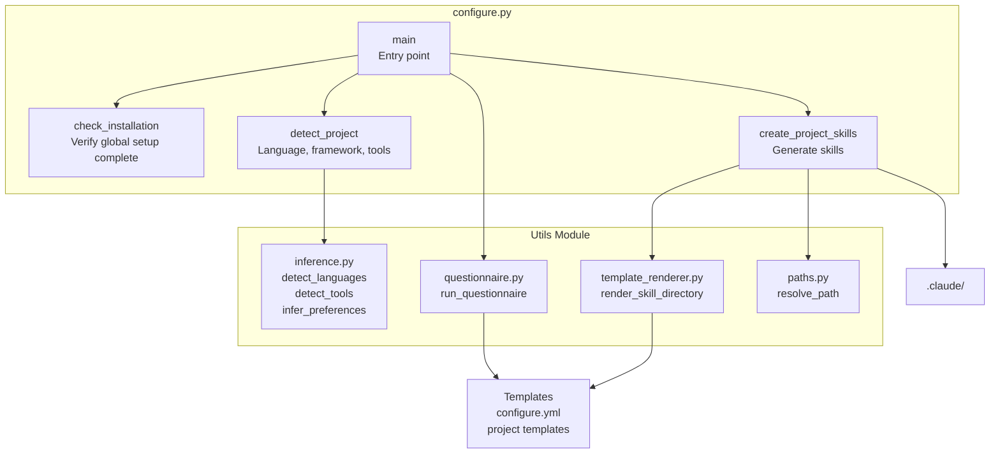
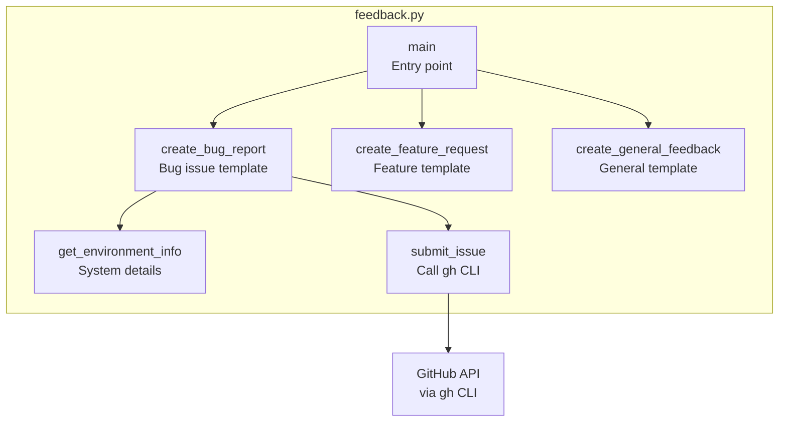
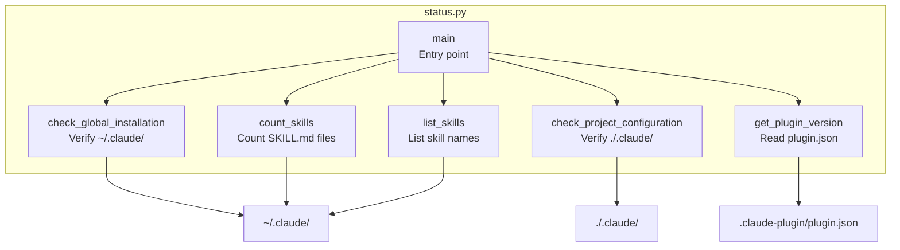
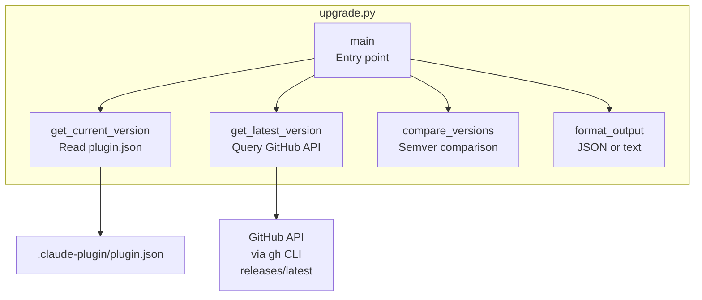
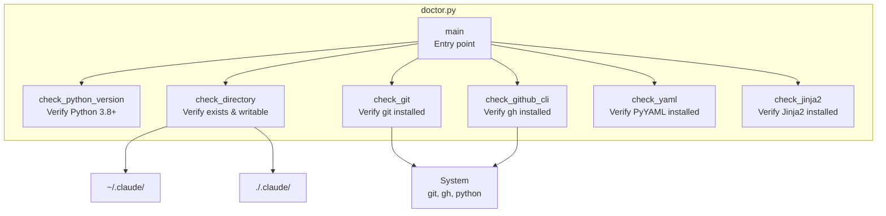

# C4 Component Diagram - AIDA Core Plugin

**Component Level**: Detailed view of Python scripts and utilities module

## Overview

This diagram shows the internal components of AIDA's Python scripts and how they interact with the
utilities module and external systems.

## Install Script Components

```mermaid
graph TB
    subgraph "install.py"
        MainInstall[main<br/>Entry point & orchestration]
        WelcomePrint[print_welcome<br/>Display welcome message]
        AlreadyInstalled[is_already_installed<br/>Check existing installation]
        CreateDirs[create_directory_structure<br/>Create skill directories]
        RenderUserContext[render_user_context<br/>Generate user-context skill]
        UpdateSettings[update_settings_json<br/>Update Claude settings]
        PrintSuccess[print_success<br/>Display success message]
        ErrorHandler[exception handler<br/>Handle errors & cleanup]
    end

    subgraph "Utils Module"
        VersionCheck[version.py<br/>check_python_version]
        PathsGet[paths.py<br/>get_claude_dir<br/>ensure_directory]
        FilesIO[files.py<br/>read_json<br/>write_json<br/>update_json]
        Questionnaire[questionnaire.py<br/>run_questionnaire<br/>load_questionnaire]
        TemplateRender[template_renderer.py<br/>render_skill_directory<br/>render_template]
        ErrorClasses[errors.py<br/>VersionError<br/>InstallationError]
    end

    Templates[Templates<br/>install.yml<br/>SKILL.md.jinja2]
    GlobalFS[~/.claude/]

    MainInstall --> WelcomePrint
    MainInstall --> VersionCheck
    MainInstall --> AlreadyInstalled
    MainInstall --> Questionnaire
    MainInstall --> CreateDirs
    MainInstall --> RenderUserContext
    MainInstall --> UpdateSettings
    MainInstall --> PrintSuccess
    MainInstall --> ErrorHandler

    AlreadyInstalled --> PathsGet
    AlreadyInstalled --> FilesIO

    CreateDirs --> PathsGet

    RenderUserContext --> TemplateRender
    RenderUserContext --> PathsGet

    UpdateSettings --> FilesIO
    UpdateSettings --> PathsGet

    Questionnaire --> Templates
    TemplateRender --> Templates

    VersionCheck -.->|Throws| ErrorClasses
    FilesIO -.->|Throws| ErrorClasses
    TemplateRender -.->|Throws| ErrorClasses

    CreateDirs --> GlobalFS
    RenderUserContext --> GlobalFS
    UpdateSettings --> GlobalFS

    style MainInstall fill:#438dd5
    style WelcomePrint fill:#85bbf0
    style AlreadyInstalled fill:#85bbf0
    style CreateDirs fill:#85bbf0
    style RenderUserContext fill:#85bbf0
    style UpdateSettings fill:#85bbf0
    style PrintSuccess fill:#85bbf0
    style ErrorHandler fill:#85bbf0
    style VersionCheck fill:#c0d9eb
    style PathsGet fill:#c0d9eb
    style FilesIO fill:#c0d9eb
    style Questionnaire fill:#c0d9eb
    style TemplateRender fill:#c0d9eb
    style ErrorClasses fill:#c0d9eb
```



## Component Details

### Install Script Components

#### get_questions(context)

##### Responsibility

Phase 1 API: Detect environment facts and return questions (none for global
install)

##### Pseudocode

```python
def get_questions(context: dict) -> dict:
    # Detect environment facts
    detected = {
        "os": platform.system(),
        "user": os.environ.get("USER"),
        "git_name": subprocess.check_output(["git", "config", "user.name"]),
        "git_email": subprocess.check_output(["git", "config", "user.email"]),
    }

    # Global install asks no questions
    return {
        "questions": [],
        "inferred": detected,
        "validation": {"valid": True, "errors": []},
    }
```

#### install(responses, inferred)

##### Responsibility

Phase 2 API: Create global AIDA structure with detected facts

##### Pseudocode

```python
def install(responses: dict, inferred: dict) -> dict:
    try:
        check_python_version()

        # Create ~/.claude structure
        ensure_directory(get_claude_dir() / "skills")

        # Write aida.yml marker
        write_aida_marker(inferred)

        # Generate user-context skill
        render_skill_directory(
            USER_CONTEXT_TEMPLATE,
            get_claude_dir() / "skills/user-context",
            inferred
        )

        return {"success": True, "message": "Global installation complete"}

    except Exception as e:
        return {"success": False, "error": str(e)}
```

##### Dependencies

- utils.version, utils.paths, utils.files, utils.template_renderer
- Phase 1 inferred data

##### Error Handling

- Returns success dict with error details if failed

#### is_already_installed()

##### Responsibility

Check if personal skills already exist

##### Algorithm

```python
def is_already_installed() -> bool:
    claude_dir = get_claude_dir()
    user_context = claude_dir / "skills/user-context"

    return user_context.exists()
```

##### Returns

True if both personal skills exist

#### create_directory_structure()

##### Responsibility

Create necessary directories

##### Algorithm

```python
def create_directory_structure() -> None:
    claude_dir = get_claude_dir()

    ensure_directory(claude_dir / "skills")
    ensure_directory(claude_dir / "skills/user-context")
```

##### Error Handling

Raises FileOperationError if cannot create

#### render_user_context()

##### Responsibility

Generate user-context skill from template using detected environment facts

##### Algorithm

```python
def render_user_context(inferred: dict) -> None:
    template_dir = Path(__file__).parent.parent / "templates/blueprints/user-context"
    output_dir = get_claude_dir() / "skills/user-context"

    variables = map_environment_to_template_vars(inferred)
    render_skill_directory(template_dir, output_dir, variables)
```

##### Dependencies

- template_renderer.py
- paths.py

#### update_settings_json()

##### Responsibility

Enable aida-core-plugin in settings.json

##### Algorithm

```python
def update_settings_json() -> None:
    claude_dir = get_claude_dir()
    settings_path = claude_dir / "settings.json"

    updates = {
        "enabledPlugins": {
            "aida-core": True
        }
    }

    update_json(settings_path, updates)
```

##### Behavior

- Creates settings.json if doesn't exist
- Merges updates (doesn't overwrite existing)
- Preserves other settings

### Configure Script Components



### Feedback Script Components



### Memento Script Components

```mermaid
graph TB
    subgraph "memento.py"
        MainMemento[main<br/>Entry point & CLI parsing]
        GetQuestionsMemento[get_questions<br/>Phase 1: Infer metadata]
        ExecuteMemento[execute<br/>Phase 2: Perform operation]
        CreateMemento[execute_create<br/>Create new memento]
        ReadMemento[execute_read<br/>Read memento]
        ListMementos[execute_list<br/>List mementos]
        UpdateMemento[execute_update<br/>Update sections]
        CompleteMemento[execute_complete<br/>Mark complete/archive]
        RemoveMemento[execute_remove<br/>Delete memento]
        RenderTemplate[render_template<br/>Jinja2 rendering]
        ParseFrontmatter[parse_frontmatter<br/>YAML extraction]
    end

    subgraph "Utils"
        PathsMemento[paths.py<br/>get_user_mementos_dir]
        FilesMemento[files.py<br/>atomic_write]
        JsonMemento[json_utils.py<br/>safe_json_load]
    end

    MementoStorage[~/.claude/memento/<br/>{project}--{slug}.md]
    Templates3[Templates<br/>work-session.md.jinja2<br/>freeform.md.jinja2]

    MainMemento --> GetQuestionsMemento
    MainMemento --> ExecuteMemento

    ExecuteMemento --> CreateMemento
    ExecuteMemento --> ReadMemento
    ExecuteMemento --> ListMementos
    ExecuteMemento --> UpdateMemento
    ExecuteMemento --> CompleteMemento
    ExecuteMemento --> RemoveMemento

    CreateMemento --> RenderTemplate
    CreateMemento --> ParseFrontmatter
    UpdateMemento --> ParseFrontmatter

    RenderTemplate --> Templates3
    CreateMemento --> PathsMemento
    CreateMemento --> FilesMemento
    ReadMemento --> PathsMemento
    ListMementos --> PathsMemento

    GetQuestionsMemento --> JsonMemento

    CreateMemento --> MementoStorage
    UpdateMemento --> MementoStorage
    ReadMemento --> MementoStorage
```

### Status Script Components



### Upgrade Script Components



### Doctor Script Components



## Utils Module Components

### version.py

#### Purpose

Python version validation

#### Components

```python
MIN_PYTHON_VERSION = (3, 8)

def check_python_version() -> None:
    """Raises VersionError if Python < 3.8"""

def get_python_version() -> tuple:
    """Returns (major, minor, patch)"""

def is_compatible_version(version: tuple) -> bool:
    """Check if version >= MIN_PYTHON_VERSION"""

def format_version(version: tuple) -> str:
    """Format as 'X.Y.Z'"""
```

#### Dependencies

None (uses sys.version_info)

### paths.py

#### Purpose

Path resolution and directory management with security validation

#### Components

```python
def get_home_dir() -> Path:
    """Returns user's home directory"""

def get_claude_dir() -> Path:
    """Returns ~/.claude/"""

def get_aida_skills_dir() -> Path:
    """Returns ~/.claude/skills/"""

def get_aida_plugin_dirs() -> List[Path]:
    """Returns all ~/.claude/skills/aida-* directories"""

def ensure_directory(path: Path, permissions: int = 0o755) -> Path:
    """Create directory if doesn't exist, validates security"""

def resolve_path(
    path: Union[str, Path],
    must_exist: bool = False,
    allowed_base: Optional[Path] = None
) -> Path:
    """Expand ~, resolve relative paths, validate security"""

def is_subdirectory(child: Path, parent: Path) -> bool:
    """Check if child is under parent"""

def get_relative_path(path: Path, base: Path) -> Path:
    """Get path relative to base"""

def safe_rglob(
    directory: Path,
    pattern: str,
    max_depth: int = 10
) -> List[Path]:
    """Recursively glob with symlink protection"""
```

#### Security Features

- Validates against null bytes (path injection)
- Rejects symlinks in critical paths
- Prevents path traversal attacks
- safe_rglob protects against symlink loops

#### Dependencies

pathlib, os, errors.py

### files.py

#### Purpose

File I/O operations with atomic writes and safety checks

#### Components

```python
def read_file(path: Path) -> str:
    """Read text file, raises FileOperationError"""

def write_file(path: Path, content: str) -> None:
    """Write text file, creates parent dirs"""

def atomic_write(path: Path, content: str) -> None:
    """Atomic write using temp file + rename"""

def read_json(path: Path) -> dict:
    """Read and parse JSON file"""

def write_json(path: Path, data: dict) -> None:
    """Write dict as JSON with formatting"""

def write_yaml(path: Path, data: dict) -> None:
    """Write dict as YAML with formatting"""

def update_json(path: Path, updates: dict) -> None:
    """Merge updates into existing JSON"""

def copy_template(src: Path, dst: Path) -> None:
    """Copy file, create parent dirs"""

def file_exists(path: Path) -> bool:
    """Check if file exists"""

def directory_exists(path: Path) -> bool:
    """Check if directory exists"""
```

#### Dependencies

json, yaml, pathlib, tempfile, errors.py

### json_utils.py

#### Purpose

Safe JSON operations with size and depth limits

#### Components

```python
MAX_JSON_SIZE = 1024 * 1024  # 1MB
MAX_JSON_DEPTH = 100

def safe_json_load(
    json_str: str,
    max_size: int = MAX_JSON_SIZE,
    max_depth: int = MAX_JSON_DEPTH
) -> dict:
    """Parse JSON with safety limits against DoS attacks"""

def validate_json_depth(obj: Any, max_depth: int) -> bool:
    """Recursively check JSON depth"""
```

#### Security Features

- Size limit prevents memory exhaustion
- Depth limit prevents stack overflow
- Used for all untrusted JSON input

#### Dependencies

json, sys

### agents.py

#### Purpose

Agent discovery and routing directive generation

#### Components

```python
def discover_agents(
    search_dirs: List[Path],
    max_depth: int = 3
) -> List[Dict[str, Any]]:
    """Discover all agent definitions in search directories"""

def generate_agent_routing_section(
    agents: List[Dict[str, Any]]
) -> str:
    """Generate markdown routing section for CLAUDE.md"""

def update_agent_routing(
    claude_md_path: Path,
    agents: List[Dict[str, Any]]
) -> None:
    """Update agent routing section in CLAUDE.md"""
```

#### Features

- Scans agents/ directories for *.md agent definitions
- Parses YAML frontmatter for agent metadata
- Generates routing directives for CLAUDE.md
- Auto-updates CLAUDE.md with agent routing

#### Dependencies

paths.py, files.py, yaml

### plugins.py

#### Purpose

Plugin discovery and configuration management

#### Components

```python
def discover_installed_plugins(
    plugins_dir: Path
) -> List[Dict[str, Any]]:
    """Find all plugins with .claude-plugin/plugin.json"""

def get_plugins_with_config() -> List[Dict[str, Any]]:
    """Get plugins that have aida-config.json"""

def validate_plugin_config(config: dict) -> Tuple[bool, List[str]]:
    """Validate plugin configuration schema"""

def generate_plugin_checklist(plugins: List[Dict]) -> str:
    """Generate markdown checklist for plugins"""

def generate_plugin_preference_questions(
    plugins: List[Dict]
) -> List[Dict]:
    """Generate questions for plugin preferences"""
```

#### Features

- Discovers plugins via .claude-plugin/plugin.json
- Reads aida-config.json for plugin configuration
- Validates permissions and recommendations
- Generates setup checklists and questions

#### Dependencies

paths.py, files.py, json_utils.py

### questionnaire.py

#### Purpose

Interactive user prompts

#### Components

```python
def load_questionnaire(path: Path) -> dict:
    """Load YAML questionnaire definition"""

def run_questionnaire(template_path: Path) -> dict:
    """Run interactive questionnaire, return responses"""

def filter_questions(questions: list, condition) -> list:
    """Filter questions based on condition"""

def questions_to_dict(responses: list) -> dict:
    """Convert response list to dict"""

# Internal helpers
def _ask_text_question(q: dict) -> str
def _ask_choice_question(q: dict) -> str
def _ask_multiline_question(q: dict) -> str
def _ask_confirm_question(q: dict) -> bool
def _display_help(help_text: str) -> None
```

#### Dependencies

yaml, files.py

#### Question Types

- `text`: Single-line input
- `multiline`: Multi-line (Ctrl+D)
- `choice`: Select from options
- `confirm`: Yes/no

### inference.py

#### Purpose

Smart project detection

#### Components

```python
def infer_preferences(project_path: Path) -> dict:
    """Detect all project characteristics"""

def detect_languages(path: Path) -> list:
    """Detect programming languages"""

def detect_tools(path: Path) -> list:
    """Detect build tools, package managers"""

def detect_coding_standards(path: Path) -> list:
    """Detect linters, formatters"""

def detect_testing_approach(path: Path) -> str:
    """Detect testing frameworks"""

def detect_project_type(path: Path) -> str:
    """Infer project category"""
```

#### Detection Methods

- File extension analysis (`.py`, `.js`, etc.)
- Config file detection (`package.json`, `pyproject.toml`)
- Directory structure patterns (`src/`, `tests/`)
- Dependency analysis (from package files)

#### Dependencies

files.py, paths.py

### template_renderer.py

#### Purpose

Jinja2 template rendering

#### Components

```python
def render_template(template_path: Path, variables: dict) -> str:
    """Render single template file"""

def render_filename(filename: str, variables: dict) -> str:
    """Render filename template"""

def render_skill_directory(
    template_dir: Path,
    output_dir: Path,
    variables: dict
) -> None:
    """Recursively render directory"""

def is_binary_file(path: Path) -> bool:
    """Check if file is binary"""

def is_template_file(path: Path) -> bool:
    """Check if file has .jinja2 extension"""

def get_output_filename(template_name: str) -> str:
    """Remove .jinja2 extension"""
```

#### Dependencies

jinja2, files.py

#### Template Features

- Variable substitution: `{{ variable }}`
- Conditionals: ``
- Loops: ``
- Filters: `{{ name | title }}`

### errors.py

#### Purpose

Custom exception hierarchy

#### Components

```python
class AidaError(Exception):
    """Base exception for all AIDA errors"""

class VersionError(AidaError):
    """Python version incompatible"""

class PathError(AidaError):
    """Invalid or inaccessible path"""

class FileOperationError(AidaError):
    """File I/O operation failed"""

class ConfigurationError(AidaError):
    """Configuration invalid or missing"""

class InstallationError(AidaError):
    """Installation failed"""
```

#### Usage

```python
if sys.version_info < (3, 8):
    raise VersionError("Python 3.8+ required")
```

## Inter-Component Communication

### Call Patterns

#### Synchronous Calls

All communication is synchronous function calls.

```python
# install.py calls utils
responses = run_questionnaire(template_path)
render_skill_directory(template_dir, output_dir, responses)
update_json(settings_path, updates)
```

#### No Asynchronous Operations

Simplicity over performance for M1.

### Data Flow

#### Installation Data Flow

```text
install.yml (YAML)
    ↓ load_questionnaire()
Question Definitions (dict)
    ↓ run_questionnaire()
User Responses (dict)
    ↓ render_skill_directory()
Template Variables (dict)
    ↓ render_template()
Rendered SKILL.md (str)
    ↓ write_file()
~/.claude/skills/user-context/SKILL.md
```

#### Configuration Data Flow

```text
Project Directory
    ↓ infer_preferences()
Detected Info (dict)
    ↓ (merged with)
configure.yml
    ↓ run_questionnaire()
User Responses (dict)
    ↓ render_skill_directory()
Project Skills
    ↓ write files
.claude/skills/project-context/SKILL.md
```

## Error Flow

```text
Low-Level Error (OSError, JSONDecodeError, etc.)
    ↓ caught by utils
Custom AIDA Exception (FileOperationError, etc.)
    ↓ propagated to
Script (install.py, configure.py)
    ↓ caught in main()
User-Friendly Error Message
    ↓
Exit with code 1
```

## Component Dependencies

### Dependency Graph

```text
install.py (skills/aida-dispatch/scripts/)
    ├─→ version.py (no dependencies)
    ├─→ paths.py (depends on: errors.py)
    ├─→ files.py (depends on: errors.py, paths.py)
    ├─→ json_utils.py (no dependencies)
    ├─→ inference.py (depends on: files.py, paths.py)
    ├─→ template_renderer.py (depends on: files.py, errors.py)
    └─→ errors.py (no dependencies)

configure.py (skills/aida-dispatch/scripts/)
    ├─→ paths.py
    ├─→ files.py
    ├─→ questionnaire.py (depends on: files.py)
    ├─→ inference.py (depends on: files.py, paths.py)
    ├─→ json_utils.py
    ├─→ template_renderer.py
    └─→ errors.py

feedback.py (skills/aida-dispatch/scripts/)
    ├─→ subprocess (stdlib)
    ├─→ pathlib (stdlib)
    └─→ re (stdlib)

memento.py (skills/memento/scripts/)
    ├─→ json (stdlib)
    ├─→ pathlib (stdlib)
    ├─→ yaml (external)
    └─→ jinja2 (external)

status.py (skills/aida-dispatch/scripts/)
    ├─→ json (stdlib)
    └─→ pathlib (stdlib)

upgrade.py (skills/aida-dispatch/scripts/)
    ├─→ json (stdlib)
    ├─→ subprocess (stdlib)
    └─→ pathlib (stdlib)

doctor.py (skills/aida-dispatch/scripts/)
    ├─→ subprocess (stdlib)
    └─→ pathlib (stdlib)
```

### No Circular Dependencies

Enforced by design:

- errors.py has no dependencies
- version.py has no AIDA dependencies
- Higher-level modules depend on lower-level only

## Testing Strategy

### Unit Testing

Each component tested independently:

```python
# Test version.py
def test_check_python_version():
    # Should not raise for current Python

# Test paths.py
def test_get_claude_dir():
    result = get_claude_dir()
    assert result.name == ".claude"

# Test files.py
def test_read_write_json(tmp_path):
    data = {"key": "value"}
    path = tmp_path / "test.json"
    write_json(path, data)
    result = read_json(path)
    assert result == data
```

### Integration Testing

Test component interactions:

```python
def test_full_installation(tmp_path):
    # Mock questionnaire responses
    # Run installation
    # Verify skills created
    # Verify settings.json updated
```

### End-to-End Testing

Test full scripts:

```bash
# Test install.py
python install.py --test-mode

# Verify outputs
ls ~/.claude/skills/user-context/
cat ~/.claude/settings.json
```

---

**See Also**:

- [Context Diagram](context-diagram.md) - System context
- [Container Diagram](container-diagram.md) - High-level containers
- [ARCHITECTURE.md](../ARCHITECTURE.md) - Architecture overview
