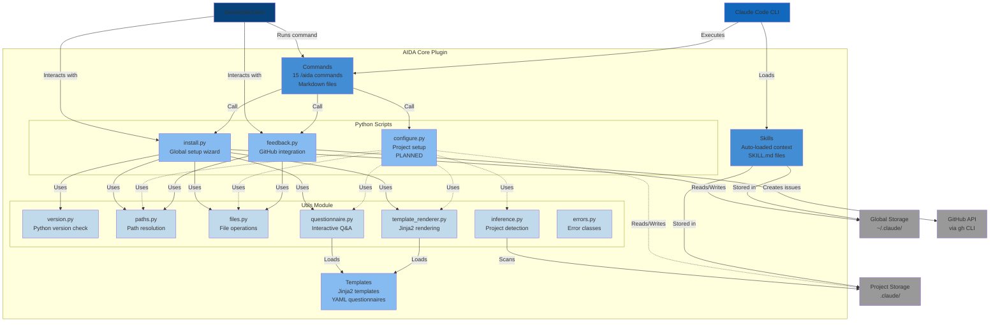

# C4 Container Diagram - AIDA Core Plugin

**Container Level**: Internal structure of AIDA and its major components

## Diagram



## Container Descriptions

### Commands Container

**Type**: Markdown files

**Technology**: Claude Code command system

**Location**: `.claude-plugin/commands/` (planned)

**Responsibilities**:
- Define `/aida` command interface
- Provide user-facing documentation
- Delegate to Python scripts

**Contents**:
- 15 command markdown files
- Each defines usage, arguments, examples

**Interactions**:
- User invokes commands
- Commands call Python scripts
- Claude Code loads and parses

### Skills Container

**Type**: Markdown files with YAML frontmatter

**Technology**: Claude Code skill system

**Location**:
- `~/.claude/skills/` (global)
- `.claude/skills/` (project)

**Responsibilities**:
- Provide context to Claude
- Auto-load without user invocation
- Persist knowledge across sessions

**Contents**:
- Personal skills (preferences, patterns)
- Project skills (context, documentation)
- AIDA core skill (management knowledge)

**Interactions**:
- Claude Code reads at startup
- AIDA creates/updates during install/configure
- User can manually edit

### Install Script

**Type**: Python script

**File**: `scripts/install.py`

**Responsibilities**:
- Global AIDA setup (run once)
- Python version check
- Interactive questionnaire
- Personal skill creation
- Settings.json management

**Dependencies**:
- utils.version
- utils.paths
- utils.files
- utils.questionnaire
- utils.template_renderer

**Entry Points**:
- `/aida install` command
- Direct invocation: `python install.py`

**Outputs**:
- `~/.claude/skills/personal-preferences/`
- `~/.claude/skills/work-patterns/`
- `~/.claude/settings.json` (updated)

### Configure Script (Planned)

**Type**: Python script

**File**: `scripts/configure.py` (planned M2)

**Responsibilities**:
- Project-specific setup
- Project detection (language, framework)
- Interactive questionnaire
- Project skill creation
- PKM symlink setup

**Dependencies**:
- utils.paths
- utils.files
- utils.questionnaire
- utils.inference
- utils.template_renderer

**Entry Points**:
- `/aida configure` command

**Outputs**:
- `.claude/skills/project-context/`
- `.claude/skills/project-documentation/`
- `.claude/settings.json`
- `.pkm/` symlink (optional)

### Feedback Script

**Type**: Python script

**File**: `scripts/feedback.py`

**Responsibilities**:
- Create GitHub issues
- Bug reports with template
- Feature requests with template
- General feedback

**Dependencies**:
- utils.paths
- utils.files
- External: `gh` CLI

**Entry Points**:
- `/aida bug` command
- `/aida feature-request` command
- `/aida feedback` command

**Outputs**:
- GitHub issues (via gh CLI)

### Utils Module

**Type**: Python package

**Location**: `scripts/utils/`

**Purpose**: Shared utilities for all AIDA scripts

#### version.py

**Responsibilities**:
- Check Python version (>= 3.8)
- Get current Python version
- Format version strings

**Key Functions**:
```python
check_python_version() -> None
get_python_version() -> tuple
is_compatible_version(version: tuple) -> bool
format_version(version: tuple) -> str
```

#### paths.py

**Responsibilities**:
- Resolve standard paths (`~/.claude/`, `.claude/`)
- Create directories
- Path validation

**Key Functions**:
```python
get_home_dir() -> Path
get_claude_dir() -> Path
get_aida_skills_dir() -> Path
ensure_directory(path: Path) -> Path
resolve_path(path: str) -> Path
```

#### files.py

**Responsibilities**:
- Read/write text files
- Read/write JSON files
- Update JSON (merge)
- File existence checks

**Key Functions**:
```python
read_file(path: Path) -> str
write_file(path: Path, content: str) -> None
read_json(path: Path) -> dict
write_json(path: Path, data: dict) -> None
update_json(path: Path, updates: dict) -> None
```

#### questionnaire.py

**Responsibilities**:
- Load YAML questionnaire definitions
- Display questions with formatting
- Collect user responses
- Validate answers
- Handle defaults

**Key Functions**:
```python
load_questionnaire(path: Path) -> dict
run_questionnaire(template_path: Path) -> dict
filter_questions(questions: list, condition) -> list
questions_to_dict(responses: list) -> dict
```

#### inference.py

**Responsibilities**:
- Detect project language
- Detect frameworks
- Detect tools and patterns
- Infer project type
- Smart defaults

**Key Functions**:
```python
infer_preferences(project_path: Path) -> dict
detect_languages(path: Path) -> list
detect_tools(path: Path) -> list
detect_coding_standards(path: Path) -> list
detect_project_type(path: Path) -> str
```

#### template_renderer.py

**Responsibilities**:
- Render Jinja2 templates
- Render entire directories
- Handle binary files
- Template filename rendering

**Key Functions**:
```python
render_template(template_path: Path, variables: dict) -> str
render_filename(filename: str, variables: dict) -> str
render_skill_directory(template_dir: Path, output_dir: Path, variables: dict) -> None
is_template_file(path: Path) -> bool
```

#### errors.py

**Responsibilities**:
- Define custom exceptions
- Error hierarchy

**Classes**:
```python
class AidaError(Exception)
class VersionError(AidaError)
class PathError(AidaError)
class FileOperationError(AidaError)
class ConfigurationError(AidaError)
class InstallationError(AidaError)
```

### Templates Container

**Type**: Files (Jinja2 .jinja2, YAML .yml)

**Location**: `templates/`

**Responsibilities**:
- Define skill templates
- Define questionnaire questions
- Provide blueprints for generation

**Contents**:
```
templates/
├── blueprints/
│   ├── personal-preferences/
│   │   └── SKILL.md.jinja2
│   ├── work-patterns/
│   │   └── SKILL.md.jinja2
│   ├── project-context/
│   │   └── SKILL.md.jinja2
│   └── project-documentation/
│       └── SKILL.md.jinja2
└── questionnaires/
    ├── install.yml
    └── configure.yml
```

## Data Stores

### Global Storage

**Location**: `~/.claude/`

**Technology**: File system

**Contents**:
- Personal skills (preferences, patterns)
- Global settings.json
- Plugin files

**Access Pattern**:
- Written during `/aida install`
- Read at every Claude Code session

### Project Storage

**Location**: `.claude/` (in each project)

**Technology**: File system

**Contents**:
- Project skills (context, documentation)
- Project settings.json

**Access Pattern**:
- Written during `/aida configure`
- Read when Claude Code starts in project directory

## External Systems

### GitHub API (via gh CLI)

**Technology**: REST API via gh CLI tool

**Used For**:
- Creating issues for bug reports
- Creating issues for feature requests
- Creating issues for feedback

**Authentication**: User's gh CLI authentication

**Data Sent**:
- Issue title
- Issue body (template + user input)
- Labels
- Environment info (optional)

## Communication Patterns

### Synchronous

**User ↔ Scripts**:
- Interactive questionnaires
- Immediate feedback
- Error messages

**Scripts ↔ File System**:
- Read/write operations
- Synchronous I/O

### Asynchronous

None in current design. All operations are synchronous for simplicity.

### Event-Driven

**Claude Code Plugin Loading**:
- Claude Code emits "plugin load" event
- AIDA registers commands and skills

## Error Handling

### Error Propagation

```
User Action
    ↓
Commands/Scripts
    ↓ (try/except)
Custom Exceptions (errors.py)
    ↓
User-Friendly Message
    ↓
Exit with appropriate code
```

### Error Recovery

**Keyboard Interrupt (Ctrl+C)**:
- Exit code 130
- No partial state saved
- Clean exit

**Validation Errors**:
- Show error message
- Re-prompt for input
- Continue questionnaire

**File Operation Errors**:
- Check permissions
- Create directories if needed
- Fail gracefully with message

## Security Boundaries

### Container Trust Boundaries

1. **User Input → Scripts**
   - Sanitize all input
   - Validate paths
   - No code execution

2. **Scripts → File System**
   - Validate paths (no traversal)
   - Check permissions
   - Safe file operations

3. **Scripts → GitHub**
   - User reviews before submit
   - No automatic submission
   - Rate limiting via gh CLI

## Performance Characteristics

### Install Script
- **Duration**: ~10-30 seconds
- **Bottlenecks**: User input (questionnaire)
- **Optimization**: Lazy imports

### Configure Script
- **Duration**: ~10-30 seconds
- **Bottlenecks**: Project detection, user input
- **Optimization**: Parallel file scanning

### Skill Loading
- **Duration**: < 1 second
- **Bottlenecks**: File I/O
- **Claude Code**: Handles loading

## Deployment

### Installation
```bash
/plugin install oakensoul/aida-core-plugin
```

### Updates
```bash
/aida upgrade  # (planned)
```

### Dependencies
- Python 3.8+
- Jinja2
- PyYAML
- gh CLI (optional)

---

**Next**: [Component Diagram](component-diagram.md) - Detailed component interactions
