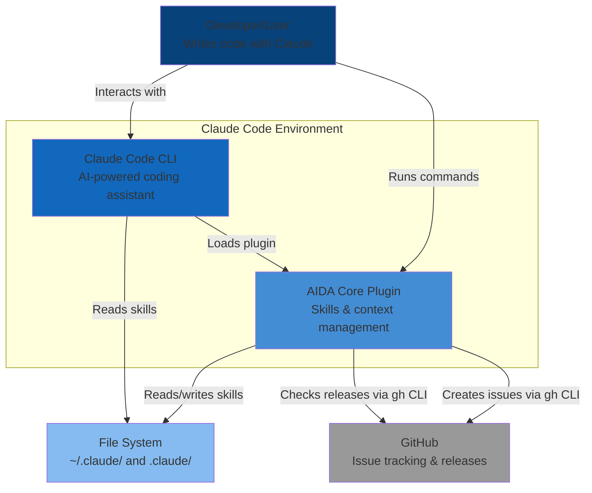

# C4 Context Diagram - AIDA Core Plugin

**System Context**: How AIDA fits into the larger ecosystem

## Diagram



## Description

### Actors

#### Developer/User

##### Role

Primary user of the system

##### Activities

- Writes code using Claude Code
- Runs `/aida` commands to configure context
- Creates custom skills/commands/agents
- Provides feedback via `/aida bug`

##### Goals

- Stop repeating project context to Claude
- Have consistent coding standards applied
- Quickly onboard to new projects
- Share knowledge with team

### Systems

#### Claude Code CLI

##### Type

External system (host)

##### Description

Anthropic's official CLI tool for Claude AI

##### Responsibilities

- Provides AI-powered coding assistance
- Loads and executes plugins
- Reads skills for context
- Executes commands

##### Integration

AIDA extends Claude Code via plugin system

#### AIDA Core Plugin

##### Type

Our system (focus of this diagram)

##### Description

Skills-first architecture plugin

##### Responsibilities

- Manages personal and project skills
- Provides installation and configuration
- Creates custom skills/commands/agents
- Integrates feedback system

##### Key Features

- `/aida` command with subcommands
- Interactive questionnaires
- Template-based skill generation
- Cross-platform support

#### File System

##### Type

External system (storage)

##### Description

Local file system for skill storage

##### Locations

- `~/.claude/` - Global configuration
- `.claude/` - Project-specific configuration

##### Data Stored

- SKILL.md files
- settings.json
- Templates
- Scripts

##### Rationale

Local-first for privacy and offline support

#### GitHub

##### Type

External system (optional)

##### Description

Issue tracking for user feedback

##### Integration

Via `gh` CLI tool

##### Used For

- Bug reports (`/aida bug`)
- Feature requests (`/aida feature-request`)
- General feedback (`/aida feedback`)

##### Data Sent

- Issue title and description
- Environment information (opt-in)
- User-provided context

## Key Relationships

### User ↔ Claude Code

- **Nature**: Primary interaction
- **Protocol**: Command-line interface
- **Frequency**: Continuous during development

### User ↔ AIDA

- **Nature**: Configuration and management
- **Protocol**: `/aida` commands
- **Frequency**: Setup, then occasional updates

### Claude Code ↔ AIDA

- **Nature**: Plugin loading and execution
- **Protocol**: Claude Code Plugin API
- **Frequency**: Every Claude Code session

### AIDA ↔ File System

- **Nature**: Data persistence
- **Protocol**: File I/O operations
- **Frequency**: During install/configure, then read-only

### AIDA ↔ GitHub

- **Nature**: Optional feedback submission
- **Protocol**: `gh` CLI tool
- **Frequency**: Ad-hoc when user reports issues

### Claude Code ↔ File System

- **Nature**: Skill loading
- **Protocol**: File reading
- **Frequency**: Every session startup

## Use Cases

### Use Case 1: First-Time Setup

```text
User → Claude Code: Start session
Claude Code → AIDA: Load plugin
User → AIDA: /aida config
AIDA → User: Show questionnaire
User → AIDA: Provide answers
AIDA → File System: Create personal skills
AIDA → File System: Update settings.json
AIDA → User: Success message
```

### Use Case 2: Project Configuration

```text
User → AIDA: /aida config
AIDA → File System: Detect project files
AIDA → User: Show detected info
AIDA → User: Show questionnaire
User → AIDA: Provide answers
AIDA → File System: Create project skills
AIDA → User: Success message
```

### Use Case 3: Bug Report

```text
User → AIDA: /aida bug
AIDA → User: Show issue template
User → AIDA: Fill template
AIDA → GitHub: Create issue via gh CLI
GitHub → User: Issue URL
```

### Use Case 4: Daily Usage

```text
User → Claude Code: Start session
Claude Code → File System: Load global skills
Claude Code → File System: Load project skills (if in project)
Claude Code → User: Ready with context
User → Claude Code: Write code
Claude Code → User: Suggestions based on skills
```

## External Dependencies

### Required

- **Python 3.8+**: For AIDA scripts
- **Claude Code**: Host system

### Optional

- **git**: For project detection
- **gh CLI**: For feedback system

## Security Boundaries

### Trust Boundary 1: User ↔ File System

- All data stays local
- No network transmission of skills
- Standard file permissions

### Trust Boundary 2: AIDA ↔ GitHub

- User reviews before submission
- No automatic data collection
- Opt-in only

### Trust Boundary 3: Claude Code ↔ Skills

- Skills are markdown (safe)
- No code execution
- Read-only access

## Scalability Considerations

### Current Scope (M1)

- Single user
- Local machine only
- No cloud sync

### Future Scope

- Team collaboration
- Cloud sync (optional)
- Plugin marketplace
- Community skills

## Privacy Considerations

- Data Location: All local (`~/.claude/`, `.claude/`)
- Network: Only `gh` CLI (opt-in)
- Telemetry: None
- Analytics: None

User has full control and ownership of all data.

---

**Next**: [Container Diagram](container-diagram.md) - Internal structure of AIDA
